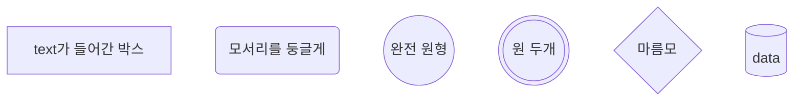
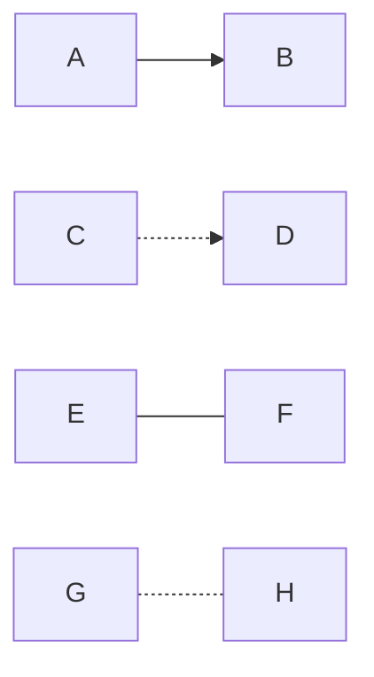
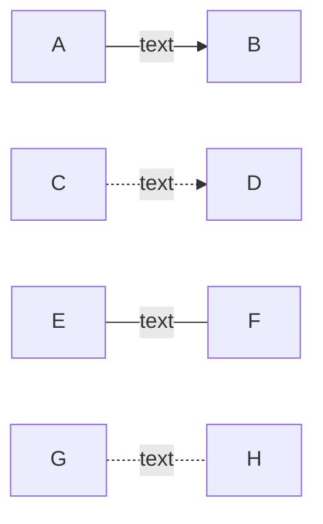
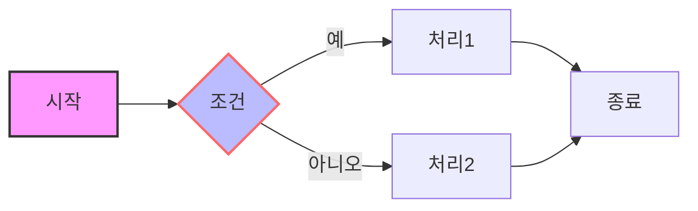
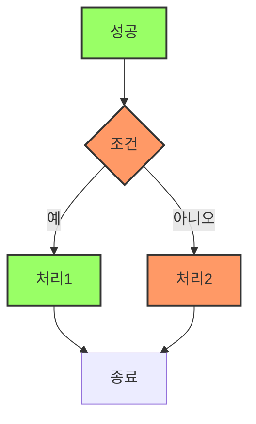
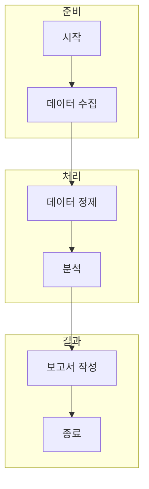

Mermaid는 간단한 텍스트 문법을 사용하여 마크다운 내에서 다양한 다이어그램과 플로우차트를 생성할 수 있는 도구입니다. 개발 문서, 블로그 포스트, 위키 등에서 시각적인 다이어그램을 쉽게 추가할 수 있어 많은 사람들이 활용하고 있습니다. 

## 사용방법

1. flowchart 방향 설정 TB, TD, BT, RL, LR 등 아래 이미지 와 같이 사용하여 방향을 설정 할 수 있습니다.
 
- TB : 위에서 아래 방향
- TD : 위에서 아래 방향(TB와 동일)
- BT : 아래에서 위 방향
- RL : 오른쪽에서 왼쪽 방향
- LR : 왼쪽에서 오른쪽 방향

2. Mermaid는 여러 가지 노드 형태를 지원합니다.

 
- 사각형: A[텍스트]
- 둥근 사각형: A(Rounded Rect)
- 원: A((텍스트))
- 다이아몬드: B{조건}
- 판넬: B[[텍스트]]

3. mermaid에서 node 간 선 잇기

 

4. mermaid에서 node 간 선에 텍스트 넣기

 

5. 스타일 지정
노드의 스타일을 지정하여 시각적으로 구분할 수 있습니다.

style: 특정 노드의 스타일을 지정합니다.
fill: 배경색.
stroke: 테두리 색.
stroke-width: 테두리 두께.

6. 링크 추가
노드에 외부 링크를 추가할 수 있습니다

7. 클래스 및 스타일링
클래스를 사용하여 여러 노드에 공통 스타일을 적용할 수 있습니다.

- classDef: 클래스를 정의합니다.
- class: 노드에 클래스를 적용합니다.

8. 서브그래프 (Subgraphs)
복잡한 다이어그램을 서브그래프로 묶어 구조화할 수 있습니다.

- subgraph: 서브그래프를 정의합니다.
- end: 서브그래프의 끝을 나타냅니다.

## 결론
Mermaid는 위에 작성된 간단한 문법을 통해 복잡한 다이어그램을 손쉽게 작성할 수 있는 강력한 도구입니다. 