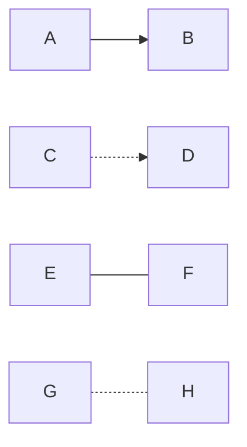
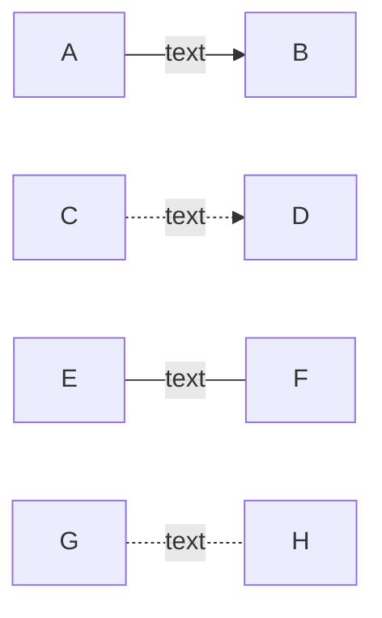

개발중 flowchart를 그릴 필요가 있을 때 notion, confluence를 사용한다면 mermaid 를 사용해서 그리면 쉽게 그릴 수 있다.

## 사용방법

1. flowchart 방향 설정 TB, TD, BT, RL, LR 등 아래 이미지 와 같이 사용하여 방향을 설정 할수 있다.

 
2. mermaid 내부에서 사용 가능한 node 도형

 

3. mermaid에서 node 간 선 잇기

 

4. mermaid에서 node 간 선에 텍스트 넣기

 